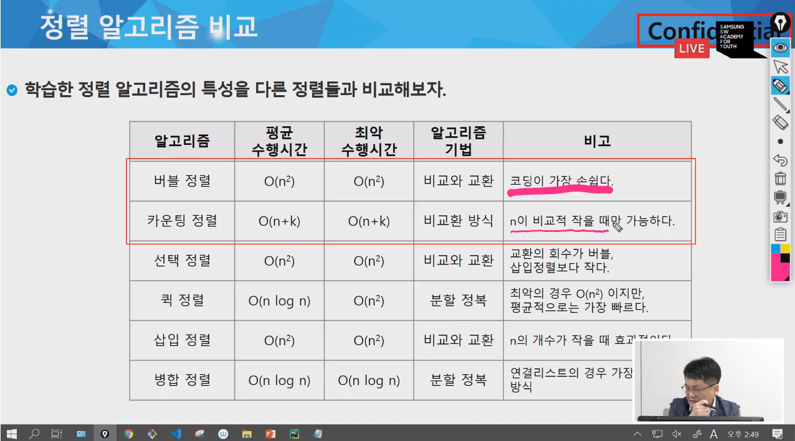
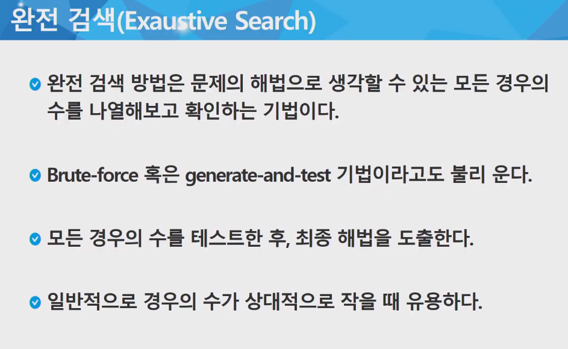

# Algorithm

## Array

| Data                    | Heap                        | Stack          |
| ----------------------- | --------------------------- | -------------- |
| Global, Static variable | Dynamic, Reference variable | Local variable |


## Sorting

> Keyword: [Bubble sort](#bubble-sort), [Counting sort](#counting-sort), [Selection sort](#selection-sort), [Quicksort](#quicksort), [Insertion sort](#insertion-sort), [Merge sort](#merge-sort) | [WIKI](https://en.wikipedia.org/wiki/Sorting_algorithm)


### Bubble sort

> Compare and swap

1. Compare two adjacent elements.
2. Swap if left-side element is bigger than right-side one.
3. Repeat until array is sorted.

```python
def bubble_sort(source):
    for i in range(len(source)-1, 0, -1):
        for j in range(0, i):
            if source[j] > source[j+1]:
                source[j], source[j+1] = source[j+1], source[j]
```


### Counting sort

> Non-swap

Count each number from source.

Accumulate element in count list.

Sort result list.

```python
def counting_sort(source, result, max_num):
    counts = [0] * (max_num+1)
    # Counting
    for i in range(len(result)):
        counts[source[i]] += 1
    # Accumulation
    for i in range(1, len(counts)):
        counts[i] += counts[i-1]
    # Sorting
    for i in range(len(source)-1, -1, -1):
        result[counts[source[i]]-1] = source[i]
        counts[source[i]] -= 1


s1 = [0, 4, 1, 3, 1, 2, 4, 1]
r1 = [0] * len(s1)
counting_sort(s1, r1, 4)
print(r1)
```

### Selection sort

### Quicksort

### Insertion sort

### Merge sort




## Searching

Exhaustive search

List all 

