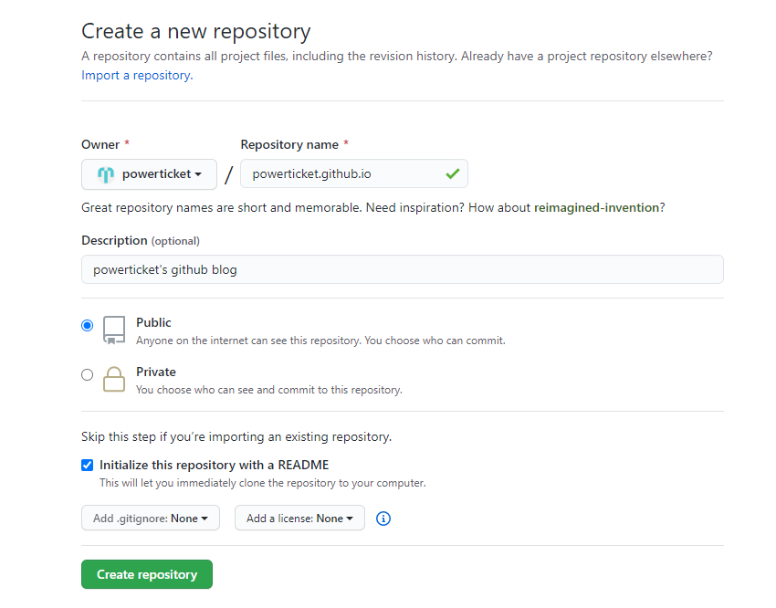

# GitHub 블로그 만들기

### 1. Repository 생성

- `{ID}.github.io`로 Repository name을 설정

- `Initialize this repository with a README` 체크
- [{ID}.github.io](https://powerticket.github.io/)로 접속해서 생성 확인

### 2.

